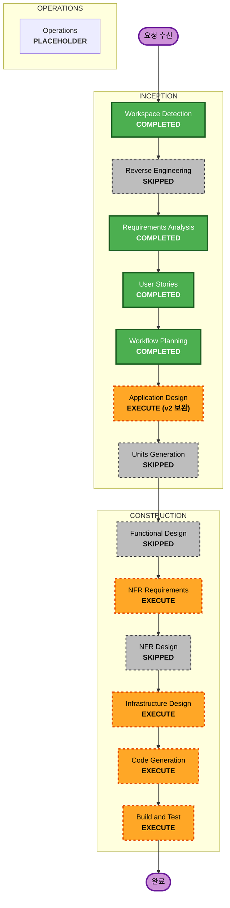

# 실행 계획서 (v2 범위 확장)

## 상세 분석 요약

### 변경 범위
- **변경 유형**: 기능 확장 + 콘텐츠 소스 전환(운영 정책)
- **핵심 변경**:
  - Notion 단일 소스 중심 설계에서 **마크다운 우선** 구조로 전환
  - `/about` 페이지를 포트폴리오 허브(프로젝트/경력/스킬)로 확장
  - 카테고리 + 태그 기반 탐색 체계 추가
  - 카드형 모던 미니멀 UI/모바일 대응 강화
- **영향 컴포넌트**:
  - 라우팅: `src/app/blog/*`, `src/app/about/*`, `src/app/categories/*`, `src/app/tags/*`
  - 데이터 레이어: `src/lib/content/*` (신규/강화), `src/lib/notion/*` (전환 대비 보조)
  - 공통 UI: 카드/배지/레이아웃/타이포그래피

### 변경 영향 평가

| 영역 | 영향도 | 설명 |
|---|---|---|
| 사용자 경험 | 높음 | 블로그 탐색, 상세 읽기, 포트폴리오 탐색 흐름 모두 변경 |
| 구조/아키텍처 | 중간 | 데이터 소스 정책(마크다운 우선)과 계층 분리 강화 필요 |
| 데이터 모델 | 중간 | frontmatter 스키마, portfolio JSON 구조 정의 필요 |
| API/계약 | 낮음~중간 | 외부 API 의존은 축소, 내부 콘텐츠 로더 계약 명확화 필요 |
| NFR | 높음 | 정적 배포 성능, 반응형 품질, CI/CD 안정성 영향 |

### 리스크 평가

| 항목 | 수준 | 근거 |
|---|---|---|
| 종합 리스크 | Medium | 다중 페이지/데이터/UI 동시 변경 |
| 롤백 난이도 | Easy~Moderate | 정적 배포 산출물 롤백 가능, 데이터 스키마 변경은 점검 필요 |
| 테스트 복잡도 | Moderate | 라우트/필터/반응형/메타데이터 검증 범위 증가 |

---

## 워크플로우 시각화

---

## 단계별 실행/스킵 결정

### INCEPTION
- [x] Workspace Detection — COMPLETED
- [-] Reverse Engineering — SKIPPED (Greenfield)
- [x] Requirements Analysis — COMPLETED (v2 반영)
- [x] User Stories — COMPLETED (stories/personas 생성 완료)
- [x] Workflow Planning — COMPLETED (본 문서)
- [ ] Application Design — **EXECUTE (v2 보완)**
  - 근거: 기존 설계가 Notion 단일 소스 중심이므로, 마크다운 우선 구조와 포트폴리오 데이터 구조 반영 필요
- [-] Units Generation — SKIPPED
  - 근거: 단일 블로그 제품 범위, 다중 유닛 분해 이점 낮음

### CONSTRUCTION
- [-] Functional Design — SKIPPED
  - 근거: 복잡 도메인 규칙보다 콘텐츠 렌더링/페이지 구성 중심
- [ ] NFR Requirements — **EXECUTE**
  - 근거: 성능(정적 빌드), 반응형 품질, CI/CD 안정성 기준 재정의 필요
- [-] NFR Design — SKIPPED
  - 근거: NFR 설계는 인프라/구현 단계 산출물로 통합 관리
- [ ] Infrastructure Design — **EXECUTE**
  - 근거: Terraform + GitHub Actions 배포 경로와 보안 시크릿 운용 기준 확정 필요
- [ ] Code Generation — **EXECUTE**
  - 근거: v2 기능(마크다운 로더, 카테고리/태그 라우트, about 포트폴리오) 구현 필요
- [ ] Build and Test — **EXECUTE**
  - 근거: 정적 빌드/타입/린트/주요 라우트 검증 필수

### OPERATIONS
- [-] Operations — PLACEHOLDER

---

## 구현 시퀀스 (v2)

1. **Application Design 보완**  
   산출물 정합화: 데이터 소스 정책(마크다운 우선), 페이지/컴포넌트 책임 재정의
2. **NFR Requirements 정의**  
   반응형/성능/배포/품질 게이트 수치화
3. **Infrastructure Design 정리**  
   Terraform 스택, GitHub Actions 배포 흐름, 시크릿/권한 정책
4. **Code Generation - 데이터 레이어**  
   `src/lib/content/` 기반 마크다운 파서/쿼리 레이어 구현
5. **Code Generation - 페이지/컴포넌트**  
   `/blog`, `/blog/[slug]`, `/about`, `/categories/[category]`, `/tags/[tag]`
6. **Code Generation - 메타 산출물**  
   sitemap/robots/feed 및 동적 메타 정리
7. **Build and Test**  
   `yarn type-check`, `yarn lint`, `yarn build` 및 주요 경로 점검

---

## 완료 기준 (Definition of Done)
- v2 범위의 User Stories를 구현 가능한 작업 단위로 연결 완료
- 마크다운 우선 콘텐츠 정책이 설계/구현 문서에 일관되게 반영됨
- 카테고리/태그/상세/About(포트폴리오) 경로의 기능 요구사항 매핑 완료
- 정적 배포 파이프라인(Terraform + GitHub Actions) 설계 근거 문서화 완료
- 빌드/검증 커맨드(`yarn type-check`, `yarn lint`, `yarn build`) 기준 명시 완료
